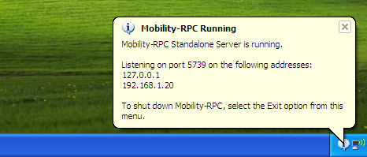

# Mobility-RPC #

Mobility-RPC is a Java library to bring seamless [Code Mobility](http://en.wikipedia.org/wiki/Code_mobility) to any application.

Move objects or tasks, execution state, **and the underlying code**, seamlessly between JVMs or machines at runtime.


## Overview of Mobility-RPC ##

Read more: [What is Code Mobility?](documentation/WhatIsCodeMobility.md) and [How does Mobility-RPC differ from conventional RPC?](documentation/ConventionalRpcComparison.md)

**Trivially easy to use**
  * Move regular, unmodified Java code and objects between machines as easily as moving them around within a single application - without deploying code to the remote machines in advance
  * Write objects which can transfer themselves and their code between machines seamlessly, and statefully
  * Compatible with third-party code (even third-party objects can be migrated)
  * Invoke arbitrary methods or third-party libraries cross-network seamlessly, even if they were never designed for RPC
  
**Powerful Design Patterns**
  * Take advantage of design patterns for network interactions which are not possible with conventional RPC
  * Supports: remote evaluation, code on demand, mobile agents (see [Wikipedia](http://en.wikipedia.org/wiki/Code_mobility) for an explanation of these things)
  
**High performance**
  * An efficient network protocol designed specifically for code mobility, outperforms and more scalable than RMI (see [Performance Benchmark](documentation/PerformanceBenchmark.md))

## Example Usage ##
These examples send objects to fictitious machines named [alice and bob](http://en.wikipedia.org/wiki/Alice_and_Bob).
In practice replace these with the name or ip address of an actual machine to which you want to send an object.


---


### Hello World ###
Print "Hello World" to the console on a remote machine called "bob".

The line of code `System.out.println("Hello World")` is actually moved to the remote machine and executed there
automatically, even though it was not deployed there in advance.
```java
public class HelloWorld {

    public static void main(String[] args) {
        QuickTask.execute("bob", new Runnable() { public void run() {
                System.out.println("Hello World");
        }});
    }
}
```


---


### Retrieve Data ###
Retrieve system properties from the remote machine and print to the console on the local machine.

```java
public class RetrieveData {

    public static void main(String[] args) {
        Properties data = QuickTask.execute("bob", new Callable<Properties>() {
            public Properties call() throws Exception {
                return System.getProperties();
            }
        });
        System.out.println(data);
    }
}
```

Here a serialized `Callable` object, and its underlying bytecode, is sent to and executed on the remote machine, and the
value it produced (a `Properties` object) is transported back to the local machine _seamlessly_.

---


### Boomerang Pattern ###
The Boomerang Pattern - a `Callable` object which returns itself.

Send a Callable object to a remote machine, where it gathers some data, and then returns itself back to the local machine. The data is printed to the console on the local machine.
```java
public class BoomerangPattern {

    static class BoomerangObject implements Callable<BoomerangObject> {

        private Properties someData;
        private InetAddress someOtherData;

        public BoomerangObject call() throws Exception {
            someData = System.getProperties();
            someOtherData = InetAddress.getLocalHost();
            return this;
        }
    }

    public static void main(String[] args) {
        BoomerangObject boomerangObject = QuickTask.execute("bob", new BoomerangObject());
        System.out.println(boomerangObject.someData);
        System.out.println(boomerangObject.someOtherData);
    }
}
```


---


### Regular Object Migration ###
Transfer a regular object to a remote machine. The object is not special in any way and does not implement any particular interfaces.

Send the object, and call its `printDetails()` method on the remote machine.
```java
public class RegularObjectMigration {

    static class RegularObject {

        private String name = "Joe Bloggs";
        private String address = "Sesame Street";

        public void printDetails() {
            System.out.println(name);
            System.out.println(address);
        }
    }

    public static void main(String[] args) {
        final RegularObject regularObject = new RegularObject();
        QuickTask.execute("bob", new Runnable() { public void run() {
                regularObject.printDetails();
        }});
    }
}
```


---


### Mobile Agent ###
An object which autonomously migrates itself around the network.

The main method transfers the object to machine _bob_, where the run() method is called. It prints "Hello World" and its hop number, 1, to the console on _bob_.

From _bob_ the object transfers itself to _alice_, which is the next machine on its list of machines to visit. It prints "Hello World" and its incremented hop number, 2, to the console on _alice_.

From _alice_ the object transfers itself back to _bob_ again, where it prints "Hello World" and an incremented hop number, 3, but then it finds that it has run out of machines to visit, so it prints "Ran out of machines to visit".

```java
public class MobileAgentPattern {

    static class MobileAgent implements Runnable {
        private List<String> machinesToVisit = new ArrayList<String>(Arrays.asList("alice", "bob"));
        private int hopNumber = 0;

        public void run() {
            MobilitySession session = MobilityContext.getCurrentSession();
            System.out.println("Hello World, this is hop number: " + (++hopNumber) + " in " + session);
            if (machinesToVisit.isEmpty()) {
                System.out.println("Ran out of machines to visit");
            } else {
                // Migrate to next machine and remove from the list...
                session.execute(machinesToVisit.remove(0), this);
            }
            session.release();
        }
    }
    // Agent visits bob, then alice, then bob again...
    public static void main(String[] args) {
        QuickTask.execute("bob", new MobileAgent());
    }
}
```

**Output on bob**
```
Hello World, this is hop number: 1 in MobilitySession{sessionId=836d7e5f-42ca-445f-acf0-4db525dcd6ab}
Hello World, this is hop number: 3 in MobilitySession{sessionId=836d7e5f-42ca-445f-acf0-4db525dcd6ab}
Ran out of machines to visit
```

**Output on alice**
```
Hello World, this is hop number: 2 in MobilitySession{sessionId=836d7e5f-42ca-445f-acf0-4db525dcd6ab}
```


---

## Getting Started ##

### Usage in Maven and Non-Maven Projects ###

Mobility-RPC is in Maven Central, and can be added to a Maven project as follows:
```
<dependency>
    <groupId>com.googlecode.mobilityrpc</groupId>
    <artifactId>mobility-rpc</artifactId>
    <version>1.1.0</version>
</dependency>
```

For non-Maven projects, **and for running Mobility-RPC as a standalone server**, a version built with [maven-shade-plugin](http://maven.apache.org/plugins/maven-shade-plugin/) is also provided.
It contains Mobility-RPC and all of its own dependencies packaged in a single jar file (ending "-all"). It can be downloaded from Maven central as "-all.jar" [here](http://search.maven.org/#search%7Cgav%7C1%7Cg%3A%22com.googlecode.mobilityrpc%22%20AND%20a%3A%22mobility-rpc%22).

### Receive Incoming Objects ###
You can run Mobility-RPC as a library inside your application on remote machine(s), or you can run Mobility-RPC as a standalone server in its own right on remote machine(s).

#### Run as a library: receive incoming objects in your application ####
Add the Maven dependency to your application, and have your application call the following method.
```java
EmbeddedMobilityServer.start();
```
Your application can then receive objects from client machines and those objects can interact with your application.

Note if your application will both send and receive objects, it is recommended that you use the same `MobilityController` for both, as provided by [EmbeddedMobilityServer](http://htmlpreview.github.io/?http://raw.githubusercontent.com/npgall/mobility-rpc/master/documentation/javadoc/apidocs/com/googlecode/mobilityrpc/quickstart/EmbeddedMobilityServer.html).

#### Run as a standalone server: send objects to arbitrary machines ####
Download the *standalone* Mobility-RPC "-all.jar" from maven central as discussed above, and then there are two ways to launch it as follows.

_**Method 1: Run in Graphical Mode**_



  * Double-click the jar on the machine on which you want to run the server. This will start Mobility-RPC as a standalone server, and it will add an icon to the system tray on Windows, the menu bar on Mac, or the notification area on Linux automatically.
  * The icon displays the IP address on which the server is running, which you can use that to send objects to the machine. The icon also allows you to shut down the mobility-rpc server when you have finished.

_**Method 2: Run from the command line**_

  * The standalone server can be launched from the command line as follows: `java -jar mobility-rpc-x.x.x-all.jar`
  * If a GUI is available, this will also start mobility-rpc standalone server in the system tray. If you wish to force the library not to use the GUI, supply "`-Dcom.googlecode.mobilityrpc.headless=true`" as a command line parameter. If no GUI is available in the first place (for example on a headless Linux server), the library will run "headless" automatically.

**Firewalls**

Note: if you have a firewall on the remote machine, choose to allow incoming connections to **port 5739** on that machine.

See [StandaloneMobilityServer](http://htmlpreview.github.io/?http://raw.githubusercontent.com/npgall/mobility-rpc/master/documentation/javadoc/apidocs/com/googlecode/mobilityrpc/quickstart/StandaloneMobilityServer.html) for more details.


---


###  Running the Examples ###
Once you have launched Mobility-RPC as a server on a remote machine, take note of the IP address on which it is listening.

The best way to get started with Mobility-RPC, is then to add the library as a dependency to a Maven project, and try running a few of the examples above in your IDE, to send objects to the remote machine.

Copy & paste the examples into your IDE, and replace "alice" or "bob" in the examples with the ip address on which the server is running. You can then start sending objects to the remote machine.

You can launch the server on multiple remote machines, to build more sophisticated applications or to send Mobile Agents around the network.


---


## API ##
The examples above mostly use the [QuickTask](http://htmlpreview.github.io/?http://raw.githubusercontent.com/npgall/mobility-rpc/master/documentation/javadoc/apidocs/com/googlecode/mobilityrpc/quickstart/package-summary.html) class, in the [quickstart](http://htmlpreview.github.io/?http://raw.githubusercontent.com/npgall/mobility-rpc/master/documentation/javadoc/apidocs/com/googlecode/mobilityrpc/quickstart/package-summary.html) package - a simplified API to the library, wrapping the main APIs, tailored for specific use cases and for getting started with the library quickly.

The main APIs of the library are marked `[`public api`]` in the [API JavaDocs](http://htmlpreview.github.io/?http://raw.githubusercontent.com/npgall/mobility-rpc/master/documentation/javadoc/apidocs/index.html), but essentially the main API is as follows:

  * [MobilityRPC](http://htmlpreview.github.io/?http://raw.githubusercontent.com/npgall/mobility-rpc/master/documentation/javadoc/apidocs/com/googlecode/mobilityrpc/MobilityRPC.html) - A static factory, to get an instance of `MobilityController`
  * [MobilityController](http://htmlpreview.github.io/?http://raw.githubusercontent.com/npgall/mobility-rpc/master/documentation/javadoc/apidocs/com/googlecode/mobilityrpc/controller/MobilityController.html) - Manages an instance of the library
  * [MobilitySession](http://htmlpreview.github.io/?http://raw.githubusercontent.com/npgall/mobility-rpc/master/documentation/javadoc/apidocs/com/googlecode/mobilityrpc/session/MobilitySession.html) - The gateway through which the application can send objects to remote machines

## Compiling from source ##
If you want to compile from source and tinker with the internals of the library itself, you will need [Protobuf](http://code.google.com/p/protobuf/) on your machine. That's command `sudo port install protobuf-java` if you're on Mac, `sudo apt-get install protobuf-java` (or similar) if you're on Linux, or download the binaries manually from the Protobuf website if you're on Windows.

Note that Mobility-RPC was compiled with Protobuf 2.4.1. If you will compile it with a newer version of Protobuf, remember to update the version of `protobuf-java` in the pom.xml file to match the version of Protobuf installed on your system.

## Documentation ##
For more documentation, see the [documentation](documentation) directory.

## Project Status ##
Mobility-RPC is in Maven Central. See [ReleaseNotes](documentation/ReleaseNotes.md) for changes.

Report any bugs/feature requests in the [Issues](http://github.com/npgall/mobility-rpc/issues) tab.
For support please use the [Discussion Group](http://groups.google.com/forum/?fromgroups#!forum/mobility-rpc-discuss), not direct email to the developers.